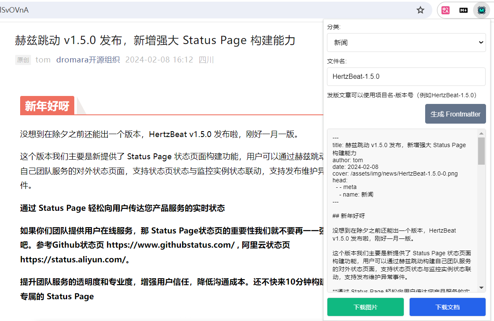

# 微信公众号文章转换至 VuePress

## 简介 📖

🚀 此 Chrome 扩展专为将微信公众号文章无缝转换成 VuePress 支持的 Markdown 格式而设计。它不仅自动化生成 Frontmatter 头部，还能下载文档和相关图片，极大简化了整个转换流程。虽然主要为 [dromara 官网](https://github.com/dromara/dromara.github.io) 定制，也欢迎广泛用于各种微信公众号文章的转换工作，即便可能需要微调 frontmatter 或图片路径。请随意 fork 并按需调整！

📦 与 mdnice 完美兼容，确保表格、代码块和标题等 Markdown 元素无损转换。

🖼️ 对于微信公众号的图片，由于存在版权问题通常不能在其他地方直接引用。通过此插件，您可以将图片下载到本地，无障碍展示。

## 使用指南 🛠️

1. **生成 Frontmatter：**
   从扩展的弹出界面中，选择文章分类，并为您的 Markdown 文件及图片前缀输入文件名。点击“生成 Frontmatter”，Markdown 文件头部信息将自动填充。

2. **下载 Markdown 文档：**
   点击“下载文档”，立即下载转换好的 Markdown 文档。
   对于 dromara 官网，下载后，直接将文件放入`src/zh/news`目录。

3. **下载文章图片：**
   “下载图片”功能允许您下载文章中全部图片，内部命名规则为输入的文件名加上序号。所有图片默认归类到单个文件夹，之后，您只需在这个文件夹中全选复制并粘贴到本地即可。
   在 dromara 官网中，简单将整个文件夹内容复制到`src/.vuepress/public/assets/img/news`路径即可。

## 注意事项 ⚠️

- 🔄 如果新文章包含之前文章已用过的图片，请优先复用旧链接，以节省存储空间并减轻克隆或部署的负担。
- 🖼️ 封面图片默认选用第一张图片，您也可以自行选择其他图片作为封面。
